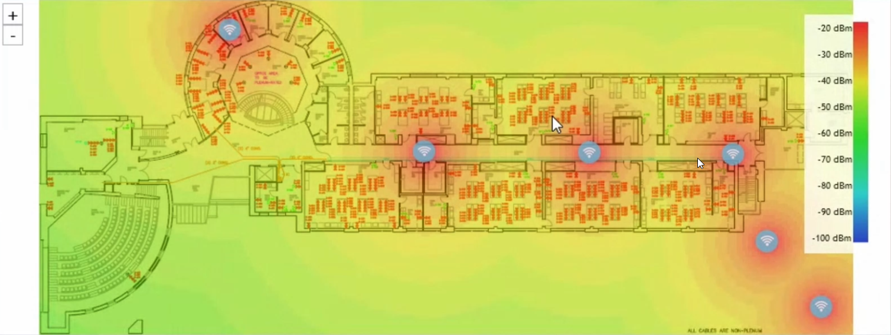
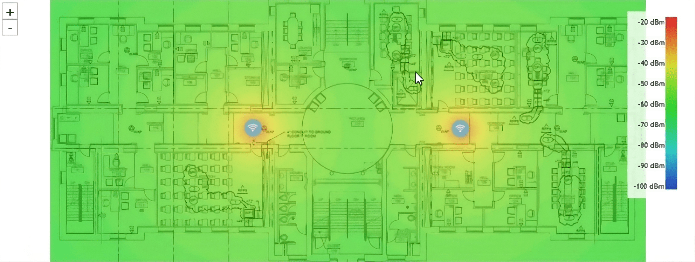
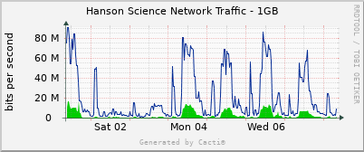
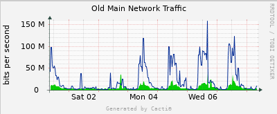

```{r echo=FALSE}
# if not installed use: install.packages("package_name")
suppressWarnings(library(readxl))
suppressWarnings(library(psych))
suppressWarnings(suppressPackageStartupMessages(library(ggplot2)))
```

```{r echo=FALSE}
# TODO: change the Actual Time format with just hours and min
hanson_data= read_excel("datasheet.xlsx", sheet="Hanson")
oldmain_data= read_excel("datasheet.xlsx", sheet="Old Main")
```


$$H_T: \textrm{There is not difference in Average Wi-Fi speed between Hanson Hall of Science and Old Main.}$$
$$H_A: \textrm{There is a difference between in average Wi-Fi speeds between Hanson Hall of Science and Old main.}$$
$$\alpha=0.05$$

### Abstract

Lorem

## I. Introduction

In today's academic landscape, reliable and high-speed internet access is crucial for various aspects of college life, including coursework, social interactions, and entertainment, all of which are increasingly reliant on online platforms such as Moodle and Google services. However, the accessibility and quality of internet networks across Augustana College campuses are not uniform, creating disparities among students.

This study focuses on the comparative analysis of Wi-Fi infrastructure quality in two distinct buildings: Hanson Hall, representing the STEM disciplines, and Old Main Hall, associated with the humanities. Rather than assuming a preconceived bias regarding the superiority of Wi-Fi infrastructure in one building over the other, our objective is to explore potential differences in internet speeds and assess if there are grounds to support claims of inequality. To ensure a well informed investigation, we sought the expertise of Scott Dean, the Network Manager for Augustana College. In his role, Scott oversees all network infrastructure on campus and is also involved in cyber security for the network.

Over the course of a week, our team conducted Wi-Fi speed tests from morning(10:25 AM) to afternoon (4:45 PM) at specific locations within Hanson Hall and Old Main Hall: the Old Main second floor central corridor (Figure 2), and the Hanson Rotunda on the second floor (Figure 1). Using the Augustana's homegrown Internet Speed Test tool ([speedtest.augustana.edu](speedtest.augustana.edu){.uri}), we gathered data on download and upload speeds, providing 16 data points for each location in the two buildings. Our hypothesis centers on investigating whether average download speeds in either Hanson Hall or Old Main significantly surpass the download speeds in the other, and if upload speeds exhibit a similar trend.

The findings presented in this report shed light on the observed variances in Wi-Fi speeds between these academic buildings. It's important to note that while our focus is on wireless speeds, we acknowledge that the potential inequality might not solely be a result of wireless infrastructure bias but could also be influenced by the physical layout and construction of the buildings. Additionally, it's crucial to clarify that our study specifically examines wireless speeds and does not encompass an analysis of wired speeds via an Ethernet port. This distinction is essential as the physical layout of the building, along with the choice of network connectivity, can impact the overall internet experience. Even more, the physical layout and construction of the building doesn't have as much of an effect, if any at all, on wired speeds.

## II. Experimental Setup and Analysis

Before diving into our methodology for data collection and our analysis, we feel it's necessary to provide contextual foundation for our study by taking a closer look at the wireless infrastructure in each building.

### a. Building Construction and WiFi Infrastructure

Starting with Hanson Hall (shown in Figure 1), the first thing to notice is that the building is quite long as compared to other buildings and not wide. Most classrooms in the building are along the hallway in the center of the buildings with a few others on the left along Lecture Hall 1 (Room 102) and right side by the new extension. Thus, to get maximum coverage, the [Access Points](https://www.cisco.com/c/en/us/solutions/small-business/resource-center/networking/what-is-access-point.html) (fancy word for routers) need to be distributed linearly across the length of the building while also covering areas like the second floor Rotunda and the new extension.



$$\textrm{Figure 1: Hanson Hall of Science} \: 2^{nd} \: \textrm{floor map with} \: 2.4GHz \: \textrm{band signal heatmap overlay} $$

Figure 1 is a floor plan of the second floor with a signal heatmap overlay for the 2.4GHz band (more details on signal bands [here](https://kb.netgear.com/000064790/What-are-WiFi-bands-and-how-many-do-I-need-for-my-network)). The heatmap visually illustrates wireless signal strength in a designated area, with the color gradients depicting varying intensities. Green or blue hues signify average to low signal strength (-50dBm to -100dBm), while red or yellow indicate above average to good signal strength (-20dBm to -50dBm). Although the picture focuses on the 2.4 GHz band, all Access Points (APs) on campus are dual band and support both 2.4GHz and 5GHz. The distinction between these bands lies in the fact that the lower frequency band provides extensive WiFi coverage but at slower speeds, while the higher band offers less coverage but faster data transmission. Additional information on wireless frequencies can be found [here](https://kb.netgear.com/29396/What-is-the-difference-between-2-4-GHz-5-GHz-and-6-GHz-wireless-frequencies). Each blue icon featuring a WiFi symbol on the map represents an AP, and it's noteworthy that the layout and distribution of routers remain consistent across all floors of the building.

Although the overall structure of Old Main (Figure 2) is similar to Hanson, just slightly wider, the biggest difference between the two buildings lies in the distribution of Access Points - Hanson clearly has a lot more per floor as compared to Old Main. We will expand on how this distinction affects our hypothesis and overall experiment in the discussion section.



$$\textrm{Figure 2: Old Main} \: 1^{st} \: \textrm{floor map with} \: 5.0GHz \: \textrm{band signal heatmap overlay} $$

### b. Data Collection

As we mentioned in the introduction, we collected data by using [speedtest.augustana.edu](speedtest.augustana.edu){.uri} on the second floor of each building: second floor rotunda in Hanson, and second floor central corridor in Old Main. This was done by running a speed test at each location around the time window for different times across the day: 10:30 AM, 1:30 PM, 3:00 PM, and 4:30 PM. The details for each data point are in this [Google Sheet](https://docs.google.com/spreadsheets/d/1y3OSnIxIV4QFOMzsykv9vPy7rWPIdvfd_vLXNGu6V1g/edit?usp=sharing).

The full data parameters for each of our data point include: location, date, expected time (our recommended time interval for everyone in our group to be there and record), actual time (our actual time during the measurement), download speed (in Mbps), upload Speed (in Mbps), ping (in ms), jitter (in ms), device manufacture, and device model.

The rest of this section shows summaries of our data and some samples of it.

```{r echo = FALSE, results = 'asis'}
suppressWarnings(library(knitr))
kable(hanson_data[, c(2, 4, 5, 6)], caption = "Data taken in Hanson Hall of Science")
kable(oldmain_data[, c(2, 4, 5, 6)], caption = "Data taken in Old Main Hall")
```

```{r}
result <-
  data.frame(
    download_diff = hanson_data$`Download Speed (Mbps)` - oldmain_data$`Download Speed (Mbps)`,
    upload_diff = hanson_data$`Upload Speed (Mbps)` - oldmain_data$`Upload Speed (Mbps)`
  )

kable(result, caption="The differece between download and upload speeds for each building")
```

```{r echo = FALSE}
# Hanson stats
h_download_mean = mean(hanson_data$`Download Speed (Mbps)`)
h_upload_mean = mean(hanson_data$`Upload Speed (Mbps)`)
h_download_sd = sd(hanson_data$`Download Speed (Mbps)`)
h_upload_sd = sd(hanson_data$`Upload Speed (Mbps)`)
# Old Main stats
o_download_mean = mean(oldmain_data$`Download Speed (Mbps)`)
o_upload_mean = mean(oldmain_data$`Upload Speed (Mbps)`)
o_download_sd = sd(oldmain_data$`Download Speed (Mbps)`)
o_upload_sd = sd(oldmain_data$`Upload Speed (Mbps)`)
# Difference download speed between building stats
download_sd = sd(result$download_diff)
download_mean = mean(result$download_diff)
# Difference upload speed between building stats
upload_sd = sd(result$upload_diff)
upload_mean = mean(result$upload_diff)

download_stats <- data.frame(
  mean_stats = c(h_download_mean, o_download_mean, download_mean),
  sd_stats = c(h_download_sd, o_download_sd, download_sd),
  row.names = c("Hanson", "Old Main", "Difference")
)
upload_stats <- data.frame(
  mean_stats = c(h_upload_mean, o_upload_mean, upload_mean),
  sd_stats = c(h_upload_sd, o_upload_sd, upload_sd),
  row.names = c("Hanson", "Old Main", "Difference")
)
sum_stats <- data.frame(download_stats, upload_stats)
colnames(sum_stats) <-
  c(
    "Download Mean (Mbps)",
    "Download Standard Deviation",
    "Upload Mean (Mbps)",
    "Upload Standard Deviation"
  )
kable(sum_stats)
```

```{r echo = FALSE, fig.align='center',out.width="75%"}
box_plt <- ggplot(result)
box_plt + geom_boxplot(aes(x = "Download Speed Difference", y = download_diff)) + geom_boxplot(aes(x =
                                                                                                     "Upload Speed Difference", y = upload_diff)) + geom_point(
                                                                                                       aes(x = "Download Speed Difference", y = download_diff),
                                                                                                       position = position_jitter(width = 0.1),
                                                                                                       alpha = 0.5
                                                                                                     ) + geom_point(
                                                                                                       aes(x = "Upload Speed Difference", y = upload_diff),
                                                                                                       position = position_jitter(width = 0.1),
                                                                                                       alpha = 0.5
                                                                                                     ) + labs(title = "Box Plot of Download & Upload Speed Difference", x = "", y = "Speed (Mbps)")
```

```{r}
summary(result$download_diff)
summary(result$upload_diff)
```

```{r echo = FALSE, result = 'asis'}
download_sd <- sd(result$download_diff)
download_mean <- mean(result$download_diff)

upload_sd <- sd(result$upload_diff)
upload_mean <- mean(result$upload_diff)

library(ggplot2)

plot_dist_hist <- function(n, mean, sd, binwidth) {
  df <- data.frame(x = rnorm(n, mean, sd))
  ggplot(df, aes(
    x = x,
    mean = mean,
    sd = sd,
    binwidth = binwidth,
    n = n
  )) +
    theme_bw() +
    geom_histogram(
      binwidth = binwidth,
      colour = "white",
      fill = "cornflowerblue",
      linewidth = 0.1
    ) +
    stat_function(
      fun = function(x)
        dnorm(x, mean = mean, sd = sd) * n * binwidth,
      color = "darkred",
      linewidth = 1
    ) + 
    theme(plot.title = element_text(hjust = 0.5)) 
}
n = nrow(result)
binwidth = 20
set.seed(1)
```

### c. Analysis: P-values and Confidence Intervals

As the descriptions of our data show, there are two dimensions to the Wi-FI: Upload and Download.

#### Hypothesis Testing

*Hypothesis Test for Download Speeds*

```{r}
download_t.value = download_mean/(sqrt((h_download_sd^2/n)+(o_download_sd^2/n)))
download_p_val = 2*(1 - pt(download_t.value, n-1))
```

$$`r download_p_val`$$

*Hypothesis Test for Uploads Speeds*

```{r}
upload_t.value = upload_mean/(sqrt((h_upload_sd^2/n)+(o_upload_sd^2/n)))
upload_p_val = 2*(1 - pt(upload_t.value,n-1))
```

$$
`r upload_p_val` 
$$

#### Confidence Intervals

We used the function below to generalize the confidence intervals (CI) for the following singular populations: Hanson Download and Upload Speed, Old Main Download and Upload speed (each separately). The function is a generalization of the following equation:\
$$P(-t < \frac{\bar{X} - \mu }{\sqrt{\frac{S^2}{n}}} < t)\\$$

```{r}
calculate_confidence_interval <- function(mean, sd, n, alpha = 0.05) {
  t_score <- qt(p = 1 - alpha / 2, df = n - 1)
  margin_error <- t_score * (sd / sqrt(n))
  
  lower_bound <- mean - margin_error
  upper_bound <- mean + margin_error
  
  confidence_interval <- c(lower_bound, upper_bound)
  
  return(confidence_interval)
}
```

*Confidence Interval for True Download Speed Population Mean in Hanson*

```{r}
h_dwnld_confidence_interval <-
  calculate_confidence_interval(h_download_mean, h_download_sd, n)
```

$$
(`r h_dwnld_confidence_interval`)
$$

*Confidence Interval for True Download Speed Population Mean in Hanson*

```{r}
h_upload_confidence_interval <-
  calculate_confidence_interval(h_upload_mean, h_upload_sd, n)
```

$$
(`r h_upload_confidence_interval`)
$$

*Confidence Interval for True Download Speed Population Mean in Old Main*

```{r}
o_dwnld_confidence_interval <-
  calculate_confidence_interval(o_download_mean, o_download_sd, n)
```

$$(`r o_dwnld_confidence_interval`)$$

*Confidence Interval for True Download Speed Population Mean in Old Main*

```{r}
o_upload_confidence_interval <-
  calculate_confidence_interval(o_upload_mean, o_upload_sd, n)
```

$$
(`r o_upload_confidence_interval`)
$$

Below this are the confidence intervals for the mean differences. They are all generalized in the next R function and are generalizations of the following CI equation:

$$P(-t < \frac{(\bar{X}_{Hanson} - \bar{X}_{Old \: Main}) - (\mu_{Hanson} - \mu_{Old \: Main}) }{\sqrt{\frac{S_{Hanson}^2}{n} + \frac{S_{Old \: Main}^2}{n}}} < t)\\$$

```{r}
calculate_confidence_interval_mean_differenc <- function(mean, sd1, sd2, n, alpha = 0.05) {
  t_score <- qt(p = 1 - alpha / 2, df = n - 1)
  
  margin_error <- t_score * sqrt((sd1^2 / n) + (sd2^2 / n))
  
  lower_bound <- mean - margin_error
  upper_bound <- mean + margin_error
  
  confidence_interval <- c(min(lower_bound, upper_bound), max(lower_bound, upper_bound))
  
  return(confidence_interval)
}
```

*Confidence Interval for the Mean Difference of Download Speeds:* $\: \mu_{Hanson} - \mu_{Old \: Main}$

```{r}
download_confidence_interval <- calculate_confidence_interval_mean_differenc(download_mean, h_download_sd, o_download_sd, n)
```

$$
(`r download_confidence_interval`)
$$

*Confidence Interval for the Mean Difference of Upload Speeds:*$\: \mu_{Hanson} - \mu_{Old \: Main}$

```{r}
upload_confidence_interval <- calculate_confidence_interval_mean_differenc(upload_mean, h_upload_sd, o_upload_sd, n)
```

$$
(`r upload_confidence_interval`)
$$

## III. Results

```{r echo = FALSE, figures-side, fig.show="hold", out.width="50%"}
plot_dist_hist(n, download_mean, download_sd, binwidth) + labs(title = "Plot of Average Download Speed Difference Distribution", x = "Speed (Mbps)", y = "Occurance")
plot_dist_hist(n, upload_mean, upload_sd, binwidth) + labs(title = "Plot of Average Upload Speed Difference Distribution",x ="Speed (Mbps)", y = "Occurance")
```

To restate what was shown in the previous section, mean difference and the standard deviation of the difference in download speeds are calculated as follows:

$$\\ \bar{X}_{Hanson} - \bar{X}_{Old \: Main}= `r download_mean` \qquad  S_{Hanson} - S_{Old \: Main} = `r download_sd`\\$$

$$\\ 2 * p(\bar{X}_{Hanson} - \bar{X}_{Old \: Main} \le `r download_mean`)) = `r download_p_val`\\ $$

The p-value of `r download_p_val` is greater than the significance level of 0.05. This indicates that the observed difference in WiFi speeds between Hanson Hall and Old Main Hall is not statistically significant at the 5% significance level. Hence we accept the null hypothesis.

The 95% confidence interval for the difference in mean download speeds between Hanson Hall and Old Main Hall, given as approximately (`r download_confidence_interval`) Mbps.

Statistical Testing of Mean Difference of Upload Speeds To test the significance of the difference, we calculate the t-statistic and the corresponding p-value:

$$\\ \bar{X}_{Hanson} - \bar{X}_{Old \: Main}= `r upload_mean`  \qquad S_{Hanson} - S_{Old \: Main} = `r upload_sd` \\$$

$$\\ p(\bar{X}_{Hanson} - \bar{X}_{Old \: Main} \le `r upload_mean`) = `r upload_p_val` \\$$

The p-value of `r upload_p_val` is greater than the significance level of 0.05. This indicates that the observed difference in WiFi speeds between Hanson Hall and Old Main Hall is not statistically significant at the 5% significance level. Hence we accept the null hypothesis.

The 95% confidence interval for the difference in mean download speeds between Hanson Hall and Old Main Hall, given as approximately (`r upload_confidence_interval`) Mbps.

## IV. Discussion

The outcomes of our study do not substantiate a definitive causation due to the limitations within a small-scale experiment. The insights that Scott, our network specialist, shared insights was a . Notably, Old Main recently underwent an upgrade in its Internet access points to align with those in Hanson, with the intent of minimizing variations in quality of the Wi-Fi signal strength; it was fitted with [Ruckus R750s](https://webresources.ruckuswireless.com/datasheets/r750/ds-ruckus-r750.pdf) as compared to Hanson's [Ruckus R650s](https://www.commscope.com/globalassets/digizuite/61773-ds-ruckus-r650.pdf) which are less capable. Despite these upgrades, Figures 1 and 2 clearly show a notable disparity in the numbers of access points between the two buildings.

A potential confounding variable arises from the distinct number of access points in each building; Old Main's 1st floor has only 2 access points, while Hanson's 2nd floor boasts 6. This difference may have contributed to the observed differences in Wi-Fi performance.

Scott D. Dean emphasized a crucial aspect---namely, that an increased number of internet devices (clients) connected to an access point inside a building can lead to a decrease in Wi-Fi speed. This principle sheds light on the observed variations and prompts us to consider the impact of user load on the network.

Taking into account the general class schedule, it is reasonable to infer that higher Wi-Fi demand on specific days, such as Monday, Wednesday, and Friday, could influence the observed differences in Wi-Fi speed. Moreover, the 2023 Fall Term received a higher number of freshmen FYI-101 classes in Old Main, as opposed to Hanson, where classrooms are primarily reserved for foundation science classes, introduces another layer of complexity. And although Hanson Has a lot more clients due to it's size and capacity, we can't say that the speeds there are slower due to multiple confounding variables including the fact that the internet traffic for both buildings was about average or even below. Check the figures below for more context.





In conclusion, while our study establishes a foundation for understanding the Internet speed between Old Main and Hanson, these confounding variables must be accounted in drawing a causal relationship. Further investigations are needed to well-explored the variations in Wi-Fi signal strength, potentially to address the differences of internet speed between a STEM building and a humanities building on Augustana College campus.

## Author's Contributions and Conclusions

**Max Sellers:**

I worked mostly on creating the calculations for the means, standard deviations, p-values, and confidence intervals for the data we had with Joshua and compared after to be confident it was correct. We all started by collecting 8 data sets each to make 32 sets, but we only calculated 16 sets at each location. However, since we needed 30 sets each, I took multiple sets in the morning because I did not have class. I collected 19 data sets out of the total 60 sets in total. This is what I did to make up for not being able to meet with ITS due to having class.

I learned in this project that analyzing Wi-Fi data has so many factors and that the samples are not very controlled. We used different devices with different operating systems (macOS, Windows OS, and iOS) and speeds (Motti's computer was faster than the others). This made it hard to collect a consistent data set. Also, the timing of when classes were in session was imperative to the data and since we had a wide range of times it would not be consistent. However, for how tricky Wi-fi is I think we tried our best to make it as consistent as possible given the circumstances like doing Hanson and Old Main with a 15-minute range of each other.

**Viet M. Bui**

In this project, I played a role in refining the initial concept, focusing on a meaningful exploration of Wi-Fi speed between two prominent campus buildings: Hanson and Old Main. I collaborated with Motti to reach out to the network specialist, Scott. Despite the week-long effort to locate the correct specialist for our project, I organized online meeting where we delved into inner working of the campus network system. Taking charge of the research layout, I structured the data collection process, establishing a systematic approach on a Google Sheet, and together with other members taking data throughout the days. Additionally, I initially crafted Introduction and Discussion sections (later modified by Motti), I also highlighting potential confounding variables that could impact the validity of our claims. I researched the appropriate organization for our statistics and created all the necessary graphs in the project. To ensure the documentation is clear for the reader, I double checked the calculation and resolving conflict of merging conflict in coding during the creation and finalize of the R studio Project. Overall, I spent a large chunk of my time to resolving coding conflict and deciding which part of the code to keep or to remove, fixing and edited calculations of others.

**Joshua Fosu-Agyemang:**

I worked mostly on calculating the means , standard deviations, p-values, and confidence intervals for the mean download and upload speed of Hanson Hall and Old Main respectively. Thus, I worked principally with Max for the results section of the project. I also did work on collecting 8 data sets from Old Main specificallay since, that was where I had most of my classes.

I studied that there could be many factors influencing WIFI, including the day accessed, the number of people on the floor at a particular time, the device used, operating systems and maybe external factors such as the ITS router. Therefore it makes it difficult to have a non-bias data. However, the ITS did help us to make our data as consistent as possible.

**Motti Kelbessa:**

Most of the tasks I did were in collaboration with Viet. I worked with him on recon for our expert, Scott Dean, and set up communications between our team and Scott so that we can get updates on the state of the network through our data collection process. As Viet metioned, I also contributed by working on the laoyout and defining the experimental setup that we used to analyse the data while also setting up background information about the campus' network infrastructure. Additionally, with the layout and structure that others provided for our report, I worked on styling the report, consolidating redundant code, and contextualizing the information we presented. Lastly, just like everyone else in the team, I collected my fair share of data.

Of all things, I learned a lot about both the infrastructure on campus and the foundation of tech that underlies it all. Working with Scott was a fun learning experience.

## References

[1] \"What is an access point?,\" Cisco, <https://www.cisco.com/c/en/us/solutions/small-business/resource-center/networking/what-is-access-point.html> (accessed Dec. 8, 2023).

[2] Netgear, \"What are WIFI bands and how many do I need for my network?,\" NETGEAR KB, <https://kb.netgear.com/000064790/What-are-WiFi-bands-and-how-many-do-I-need-for-my-network> (accessed Dec. 8, 2023).

[3] Netgear, \"What is the difference between 2.4 GHz, 5 GHz, and 6 GHz wireless frequencies?,\" NETGEAR KB, <https://kb.netgear.com/29396/What-is-the-difference-between-2-4-GHz-5-GHz-and-6-GHz-wireless-frequencies> (accessed Dec. 8, 2023).
